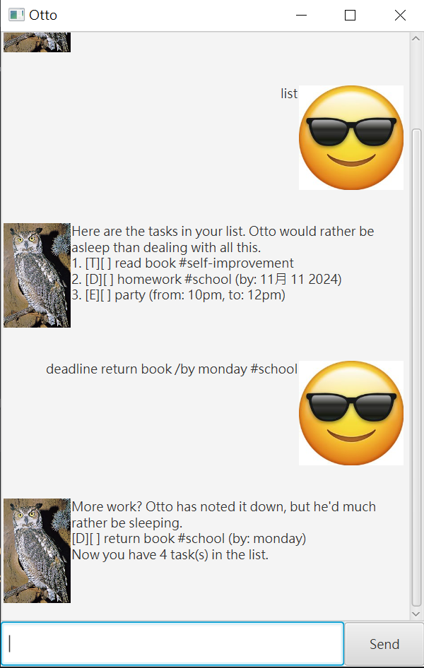

# Otto User Guide 🦉



Otto would rather be napping, but he supposes he can help you with your tasks.

## Getting Started
To interact with Otto the owl, simply type commands into the input
field. Otto will respond with the appropriate information or take the
necessary actions based on your input.

## Add todos
This feature allows you to add simple to-do tasks without any specific deadline.

### Command Format

Example: `todo <description>`
 
Otto will add the todo task to your list. `todo` tasks are noted with a `T` in the list.

```
More work? Otto has noted it down, but he'd much rather be sleeping.
[T][ ] <description>
Now you have <number> task(s) in the list.
```

## Add deadlines
This feature allows you to add tasks with specific deadlines to help you track
time-sensitive tasks.

### Command Format

Provide the `deadline` indicated by `/by`.

Example: `deadline <description> /by <deadline>`

If your `deadline` contains `yyyy-mm-dd`, Otto will recognize it as a date. 
Otherwise, Otto will treat it as a string.

Otto will add the task to your list with the specified deadline.
`deadline` tasks are noted with a `D` in the list.

```
More work? Otto has noted it down, but he'd much rather be sleeping.
[D][ ] <description> (by: <deadline>)
Now you have <number> task(s) in the list.
```

## Add events
This feature allows you to add event tasks with a starting and end time.

### Command Format

Provide the `start` and `end` time indicated by `/from` and `/to`.

Example: `event <description> /from <start> /to <end>`

Otto will add the task to your list with the `start` and `end` time. 
(Note: `start` and `end` are treated as strings, unlike `deadline`.)

`event` tasks are noted with an `E` in the list.

```
More work? Otto has noted it down, but he'd much rather be sleeping.
[E][ ] <description> (from: <start>, to: <end>)
Now you have <number> task(s) in the list.
```

## Tag tasks
This feature allows you to tag tasks with specific tags.
Tags are optional and can be added to any task.

### Command Format
Add any number of tags (indicated by `#`) to the end of the task.

Example: `todo <description> #<tag1> #<tag2>`
`deadline <description> /by <deadline> #<tag1> #<tag2>`
`event <description> /from <start> /to <end> #<tag1> #<tag2>`

Otto will add the task to your list with the specified tags.
```
More work? Otto has noted it down, but he'd much rather be sleeping.
[D][ ] <description> #<tag1> #<tag2> (by: <deadline>)
Now you have <number> task(s) in the list.
```

## View task list
This feature allows you to see all the tasks in your list.

### Command Format

Example: `list`

Otto will display all tasks.

```
Here are the tasks in your list. Otto would rather be asleep than dealing with all this.
1. [T][X] <description1>
2. [D][ ] <description2> #<tag1> #<tag2> (by: <deadline>) 
3. [E][X] <description3> (from: <start>, to: <end>)
```

## Mark and unmark tasks
This feature allows you to mark a task as done or not done.

### Command Format

Example: `mark 4`
`unmark 4`

Otto will mark the task at position 4 as done or not done. 
The position is based on the list of tasks.
Completed tasks are marked with an `X`.

```
Well, finally. You finished something.
[T][X] <description>
```

## Delete tasks
This feature allows you to delete tasks in the list.

### Command Format

Example: `delete 1`

Otto will delete task at specified index.

```
Finally, something Otto can get behind: deleting a task. It's gone now, just like Otto wishes he could be... back to his nap.
[T][ ] <description>
Now you have <number> task(s) in the list.
```

## Find tasks
This feature allows you to search for task description with a keyword.

### Command Format
Example: `find <keyword>`

Otto will display all tasks containing the keyword in the description.

```
> find book

Here are the matching tasks in your list. Otto would rather be asleep than dealing with all this.
[T][ ] read book #hobby
[D][ ] return book (by: 2024-09-30)
[E][X] book party (from: 2024-09-30, to: 2024-09-31)
```

## Find tags
This feature allows you to search for tasks with a specific tag.

### Command Format
Example: `tag <tag>`

Otto will display all tasks with the specified tag.

```
> tag school

Here are the matching tasks in your list. Otto would rather be asleep than dealing with all this.
[T][ ] do homework #school
[D][ ] submit assignment #school #urgent (by: 2024-09-30)
```

## Exit
This feature allows you to exit the application.

### Command Format
Example: `bye`

Otto will bid you farewell and close the application.
